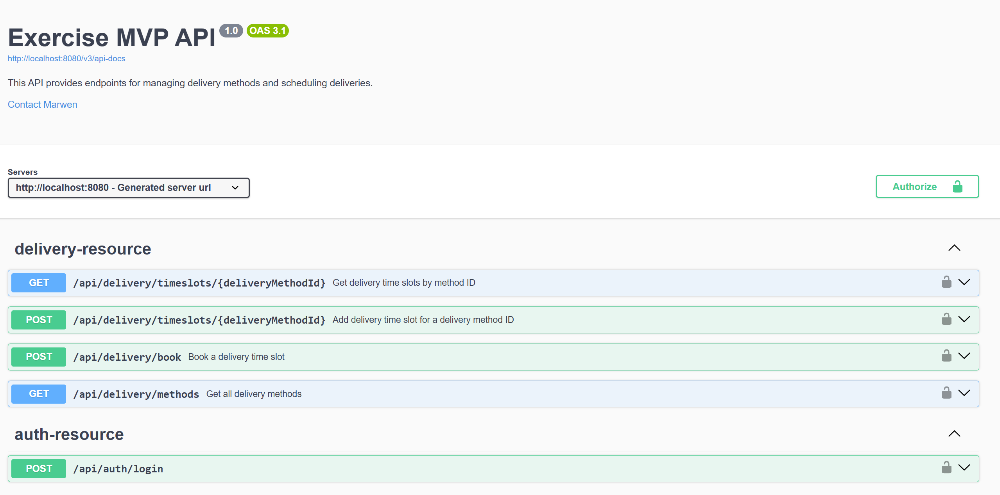
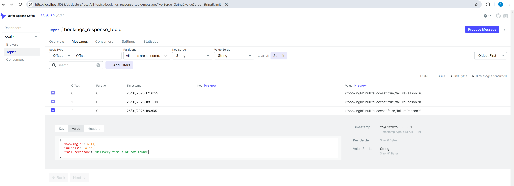

# Deliver App

Carrefour kata

## Run app locally

```bash
git clone https://github.com/benabdesslem/kata-carrefour.git
cd kata-carrefour
./mvnw package
java -jar target/*.jar
```

You can then access the app at http://localhost:8080/webjars/swagger-ui/index.html#/ and enter the
URL http://localhost:8080/v3/api-docs in the input field, then click on Explore to view the APIs.


Or you can run it from Maven directly using the Spring Boot Maven plugin:

```bash
./mvnw spring-boot:run
```

Use Swagger UI to log in with default user credentials (username: user1, password: user1), configure Bearer token
authorization, and access other APIs.

## Implementation Overview:

#### Project Structure

```plaintext
       +------------------------+
       |      Application       |  
       |------------------------|
       |  - DTO                 |  
       |  - Port                |
       |  - Service             |
       +-----------+------------+
                   |
                   v
       +------------------------+
       |       Domain           |
       |------------------------|
       |  - Exception           |
       |  - Model               |
       |  - Repository          |
       |  - Service             |
       +-----------+------------+
                   |
                   v
       +------------------------+
       |     Infrastructure     |
       |------------------------|
       |  - Adapter (Repository Implementations) |
       |  - Config              |
       |  - Entity              |
       |  - Exception           |
       |  - Repository          |
       |  - Resource (API Controllers) |
       +------------------------+
```

1. application

This layer contains the use cases of the application (services), as well as the interfaces for inbound and outbound
ports.

- dto: Contains Data Transfer Objects (DTOs) used for communication between layers.
- port: Contains the interfaces for both inbound (use cases) and outbound (interactions with external services) ports.
- service: Implements services that use the inbound ports to execute business logic.

2. domain

This layer contains the business logic of the application, data models, and business services.

- exception: Contains custom exceptions used within the domain.
- model: Data models representing business entities.
- repository: Interfaces for data management.
- service: Contains business logic specific to the application.

3. infrastructure

This layer handles interactions with external systems, such as databases, security systems, and other external services.

- adapter:  Contains the implementations of repository methods that allow interaction with external systems. These
  implementations serve as the bridge between the domain's repository interfaces and the actual data source.
- config: Contains the application's configuration.
- entity: Entities used for data persistence.
- exception: Contains exceptions specific to the infrastructure.
- repository: Implementations of repository interfaces defined in the domain, for data persistence.
- resource: Contains REST controllers or API resources.

#### Implemented APIs:

1. **POST /api/auth/login:**
    - Request body:
      ```
      {
        "login": "user1",
        "password": "user1"
      }
      ```
    - This API is used for authentication and returns a JWT token for accessing other APIs.

2. **GET /api/delivery/methods:**
    - Returns the list of delivery methods.

3. **GET /api/delivery/Timeslots/${deliveryMethodId}:**
    - Returns the list of delivery time slots for a given delivery method.

4. **POST /api/delivery/timeSlots/${deliveryMethodId}:**
    - Allows reserving a delivery time slot for a given delivery method.
    - Added to demonstrate cache eviction when adding a new time slot for a specific delivery method.

5. **POST /api/delivery/book:**
    - Allows booking a delivery time slot for a given delivery method.

#### Documentation with Swagger:

- Swagger is utilized to document the API.
- Use the default user credentials:
    - Username: "user1"
    - Password: "user"
- Click on "Authorize" to configure Bearer Authentication for accessing other APIs.

#### Authentication and Security:

- JWT authentication is implemented with Spring Security.
- H2 database is used for storing user information.

#### Reactive Solution:

- Spring WebFlux is integrated for a non-blocking solution.
- Spring Data R2DBC is used for reactive access to SQL databases.

#### Testing:

- Unit tests are added for the service layer.
- Integration tests are included for the resources.

#### Database Configuration:

- H2 database with file-based storage is used for development.
- In-memory H2 database is utilized for unit tests.
- Liquibase utilized for managing schema migrations: To ensure controlled and consistent management of schema updates,
  facilitating collaboration and tracking changes among team members.

#### Caching:

- Implemented in-memory caching for the methods `getAllDeliveryMethods` and `getDeliveryTimeSlotsByMethodId`.
- Demonstrated cache eviction when adding a new time slot for a specific delivery method.

## Stream

Implementation of a real-time streaming solution for handling reservations.
Messages are consumed from the bookings_receiver_topic, processed,
and then responses are sent to the `bookings_response_topic`.
The `@Component` annotation in `BookingMessageListener` and the `@configuration` in `KafkaConfig` have been commented
out to prevent any blocking of project execution in the absence of an active Kafka server.

To test, use the Apache Kafka UI at http://localhost:8089/ to send a message to the bookings_receiver_topic.

    {
    "timeSlotId": 1,
    "userId": 1
    }

The application will consume the message, process it, and send a response to bookings_response_topic:

    {
    "bookingId": null,
    "success": true,
    "failureReason": null
    }



## Packaging

### Creating a Container of Your Application

Build and run the project using Docker and Docker Compose.

1. Build the Docker Image

First, you'll need to build the Docker image for the project.

```sh
docker build -t deliver-image .
```

This command will create a Docker image tagged as deliver-image using the Dockerfile in the current directory.

2. Start the Application with Docker Compose
   Once the image is built, you can start the application using Docker Compose.

Run the following command:

```sh
docker-compose up -d
```

3. Access the Application

Once the containers are running, you can access the following services:

**Apache Kafka UI:**

Open the following URL in your web browser to access the Apache Kafka UI:

```plaintext
http://localhost:8089/
```

**API Swagger UI:**

To explore and test the available APIs, open the Swagger UI at the following URL:

```plaintext
http://localhost:8080/webjars/swagger-ui/index.html#/
```

You can explore the API documentation by navigating to the **/v3/api-docs** endpoint.

## Deployment

1. Building Docker Image with Minikube:
   This command builds a Docker image of your application using Minikube.

```sh
minikube image build -t deliver-image .
```

2. Deploying Kafka Services

```sh
kubectl apply -f kafka-deployment.yaml
```

3. Applying Kubernetes Deployment:

```sh
kubectl apply -f kub-deployment.yaml
```

4. Checking Deployed Pods:

```sh
kubectl get pods
```

5. Port Forwarding for Application Access:

```sh
kubectl port-forward deliver-deployment-755d996b6c-cpcng 8081:8080
kubectl port-forward deliver-deployment-755d996b6c-jnk8h 8082:8080
```

These commands enable you to forward ports from pods to your local machine so you can access your application through
them.

6. Copying nginx.conf File and Starting Nginx for Load Balancer:
   Copy the configuration from the nginx.conf file and restart nginx, then navigate
   to http://localhost/webjars/swagger-ui/index.html#/ to access the app.
